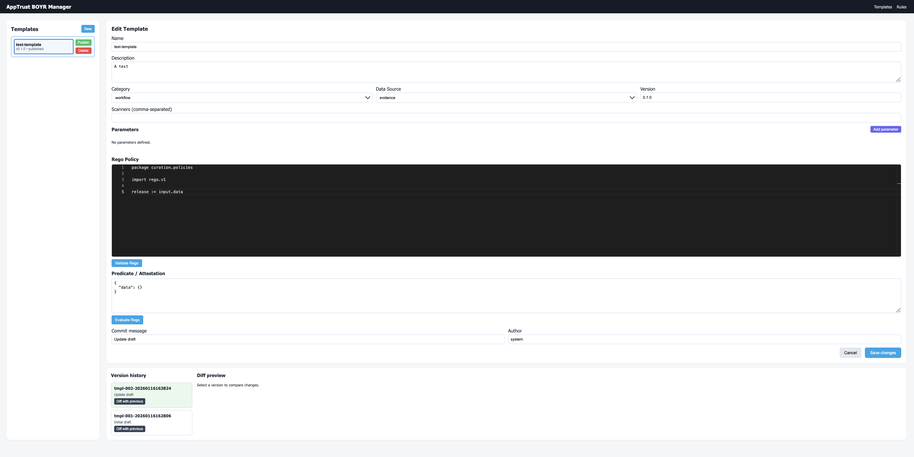

# AppTrust Templates and Rules Manager

Full stack application for authoring, versioning, and publishing JFrog AppTrust templates and rules. Draft changes are stored locally with git-style version history, and only published versions are pushed to JFrog via the AppTrust REST APIs.

## Screenshot



## Features

- FastAPI backend with SQLite storage and SQLModel ORM.
- Git-like versioning (timestamped refs, author, commit message) for every template and rule change.
- Publish workflow that pushes drafts to JFrog only on demand.
- Rego editing surface backed by Monaco with on-demand validation (OPA optional).
- React + Vite frontend with React Query state management.

## Project layout

```
backend/
  app/
    core/            # configuration settings
    routers/         # FastAPI route modules
    services/        # JFrog client, versioning, rego validation helpers
    main.py          # application entry point
  pyproject.toml     # backend dependencies
frontend/
  src/               # React application sources
  package.json       # frontend dependencies
.env.example         # backend configuration template
```

## Getting started

1. **Clone configuration**
   ```bash
   cp .env.example .env
   ```
   Update the values with your JFrog credentials and a local OPA binary path for syntax validation.

2. **Backend setup**
   ```bash
   cd backend
   python3.12 -m venv .venv
   source .venv/bin/activate
   pip install -e .
   uvicorn app.main:app --reload
   ```

3. **Frontend setup**
   ```bash
   cd ../frontend
   npm install
   npm run dev
   ```
   The development server proxies `/api` to the FastAPI backend on port 8000.

## JFrog integration notes

- Templates map 1:1 with the payload structure documented in the [JFrog Templates API](https://jfrog.com/help/r/jfrog-rest-apis/templates?tocId=WmVoqy6yzh6MFnWqNXxzAA).
- Rules adopt the schema from the [JFrog Rules API](https://jfrog.com/help/r/jfrog-rest-apis/rules).
- Local drafts keep their own semantic version string; publishing updates the remote object while retaining the draft history.

## Rego validation

If the `OPA_BINARY_PATH` is provided (or `opa` is available on `$PATH`), the backend uses `opa fmt` to validate Rego syntax. Without OPA the validator checks for a package stanza and returns a warning that full validation was skipped.

## Testing

Minimal pytest scaffolding can be added under `backend/tests`. React components can be tested with Vitest or Cypress as needed.

## Next steps

- Harden error handling and surface remote validation errors in the UI.
- Add authentication (OIDC/JWT) if multi-user access is required.
- Integrate diff visualization using a richer component for large policies.
